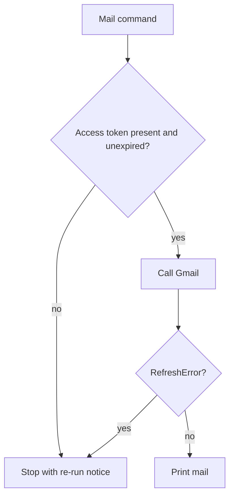

# Access Token Handoff - Plan

## Goal Capsule

- **Objective:** Mail commands in Linux receive only a short-lived Gmail access token. The refresh token and OAuth client secret stay in macOS Keychain. The host refreshes each mailbox access token and passes only those tokens in. The container does not call the token endpoint on the mail path.
- **Authority:** This Product Contract wins on behavior. Key Technical Decisions win on mechanism inside those requirements. `docs/plans/2026-09-28-003-feat-in-memory-credential-handoff-plan.md` and the credential-export steps in `docs/plans/2026-09-28-005-feat-local-morning-digest-plan.md` are not this contract.
- **Stop:** Do not build the morning file, banner, or timer. Do not install packages. Do not put a refresh token or client secret in the container on a mail run. Do not rewrite plan 005 or plan 003 in place.
- **Execution:** code. Tail ownership stays with the executor after this plan.

## Product Contract

### Summary

The Mac keeps Gmail's long-lived secrets in Keychain. A host script refreshes each mailbox access token and hands only those tokens to Linux, one per mailbox. An open Dev Container keeps the tokens in its own tmpfs and reads mail until a token expires. A one-shot run gets separate tokens and does not touch the Dev Container copy. Login is the only run that brings a new refresh token back to Keychain.

### Problem Frame

Python runs in Linux, and Linux cannot open macOS Keychain. The current bridge copies the full token JSON into `.creds/` under the repo so the container can refresh it and write it back. Those files sit where other tools can read them, and a missed cleanup leaves them behind.

### Key Decisions

- **The container receives an access token only.** (session-settled: user-approved — chosen over an encrypted refresh-token file in the container and over a network helper: mail code must not hold a refresh token.) Governs R1, R3, R4.
- **The host side is a shell script.** (session-settled: user-approved — chosen over gog and over a resident helper: no new packages on the Mac.) Governs R3, R8.
- **A one-shot run does not touch the open container's token.** (session-settled: user-approved — chosen over sharing one token with the Dev Container: the user confirmed the morning run stays separate.) Governs R6.
- **Login returns the new mailbox token once.** (session-settled: user-approved — chosen over leaving the refresh token in the container: consent can run in Linux, storage stays on the Mac.) Governs R7.

### Requirements

**Where secrets live**

- R1. macOS Keychain is the only durable store for the OAuth client secret and for each mailbox token (`email1`, `email2`).
- R2. A mail run does not leave the client secret or a refresh token in a file on the host disk or in the repo tree.

**Mail runs**

- R3. One host invocation refreshes each configured mailbox (`email1`, `email2`) when its access token is due and passes only those access tokens into the container, one per mailbox. Due means the stored expiry is missing, or `google-auth==2.40.3` would already treat the token as expired: naive UTC computed from `expires_in`, at least 3 minutes 45 seconds before the token's expiry. A re-run in that window mints a new access token.
- R4. Mail code in the container does not call Google's token endpoint and does not hold a refresh token.
- R5. When the access token is missing, expired, or rejected, the mail command stops and tells the user to run the host script again. It does not restart the container.

**One-shot versus Dev Container**

- R6. A one-shot run receives its own access token for each configured mailbox and does not read or write the access tokens stored for the long-lived Dev Container. The caller keeps that stdout in memory and does not write it to the day file, the repo, shell history, or logs.

**Login and failure**

- R7. Login may receive the client secret for that run only. The host stores the new mailbox token in Keychain. The container does not keep it after the run.
- R8. When Google rejects the refresh token, the host script reports that login is required. The report includes no secret and no mail text. The report does not occupy the one-shot token stdout. That stdout is not a token when login is required.

### Actors

- A1. Owner. Runs login, asks for mail inside the Dev Container, and sees a re-login or re-refresh notice.
- A2. Mac host script. Reads Keychain, refreshes the access token, and passes that token on.
- A3. Container process. Reads mail with the access token, or completes browser consent during login. Does not call Keychain.

### Key Flows

- F1. Mail inside the open Dev Container
  - **Trigger:** A1 wants mail while the Dev Container is already running.
  - **Actors:** A1, A2, A3
  - **Steps:** A2 reads Keychain, refreshes each access token if it is due, and writes only those tokens into the Dev Container tmpfs, one file per configured mailbox. A3 reads mail. A3 does not refresh.
  - **Covered by:** R3, R4, R5

- F2. One-shot run
  - **Trigger:** A later morning job, or a manual one-shot, needs mail without the Dev Container.
  - **Actors:** A2, A3
  - **Steps:** A2 refreshes if needed and emits one access token per configured mailbox on stdout for that run only. A2 does not write the Dev Container tmpfs. When refresh is rejected, the re-login notice does not occupy that stdout, and the stdout is not a token.
  - **Covered by:** R6, R8

- F3. Login
  - **Trigger:** A1 logs in a mailbox, including after Google rejects the refresh token.
  - **Actors:** A1, A2, A3
  - **Steps:** A2 passes the client secret into A3 for that run. A3 completes consent and returns the new mailbox token. A2 stores it in Keychain. A3 keeps no copy.
  - **Covered by:** R1, R7

- F4. Expired access token
  - **Trigger:** A3 starts a mail command and the access token is missing, expired, or Gmail rejects it.
  - **Actors:** A1, A3
  - **Steps:** A3 stops with a notice to run the host script again. A3 does not refresh. The container keeps running.
  - **Covered by:** R4, R5

### Acceptance Examples

- AE1. Fresh access token
  - **Covers:** R3, R4
  - **Given:** The container has a current access token and no refresh token.
  - **When:** A1 runs a mail command.
  - **Then:** Gmail is called with that access token, and the process does not call the token endpoint.

- AE2. Expired access token
  - **Covers:** R4, R5
  - **Given:** The access token is expired or Gmail returns 401.
  - **When:** A1 runs a mail command.
  - **Then:** The command stops with a re-run notice, the refresh token in Keychain is unchanged, and the container is still running.

- AE3. One-shot isolation
  - **Covers:** R6
  - **Given:** The Dev Container already holds an access token.
  - **When:** A2 emits a token for a one-shot run.
  - **Then:** The Dev Container copy is unchanged.

- AE4. Login write-back
  - **Covers:** R2, R7
  - **Given:** Keychain has the client secret and no token for `email1`.
  - **When:** A1 finishes login for `email1`.
  - **Then:** Keychain holds the `email1` token, and the container has no client or token file left behind.

- AE5. Rejected refresh token
  - **Covers:** R8
  - **Given:** Google rejects the refresh token.
  - **When:** A2 tries to refresh.
  - **Then:** A1 sees a re-login notice with no secret and no mail text, and the one-shot token stdout is not a token.

- AE6. Mail refresh leaves no durable secret
  - **Covers:** R2
  - **Given:** Keychain holds the client secret and the mailbox token.
  - **When:** A2 refreshes and hands off access tokens, including when refresh fails.
  - **Then:** The host disk and the repo tree contain no client secret and no refresh token.

### Scope Boundaries

This plan replaces the credential inject described in `docs/plans/2026-09-28-003-feat-in-memory-credential-handoff-plan.md` and the Keychain-to-directory export in `docs/plans/2026-09-28-005-feat-local-morning-digest-plan.md`. Those files stay as they are. Do not implement their inject.

Out of scope:

- The morning day file, banner, and timer.
- Morning summary and Telegram.
- Changing the Google Cloud publishing status. A Testing app still needs a manual login about every 7 days. R8 covers the failure notice only.
- Touch ID on Keychain reads.
- The host calling Gmail itself.
- gog, or an encrypted refresh-token file inside the container.
- Installing pytest or any other package.

### How This Work Fits Together

The morning plan still owns the clock, the day file, and the banner. When that work is built, its host command consumes the one-shot stdout from F2 in memory and does not write that stdout to the day file, the repo, shell history, or logs. It does not grow its own Keychain export.

---

## Planning Contract

### Key Technical Decisions

- KTD1. Mail commands build a bearer credential from `access_token` and `expiry` only. The loader refuses a payload that contains `refresh_token` or `client_secret`. (session-settled: user-approved — chosen over `from_authorized_user_info`: that constructor requires the refresh token and the client secret, which would put R4 secrets back in the container.) Governs R4. `google-auth==2.40.3` calls the token endpoint from `Credentials.refresh` only when those refresh fields are present. `expiry` is naive UTC computed from `expires_in`. The host and the loader share one due predicate: the token is due when now is at or after expiry minus 3 minutes 45 seconds (`google.auth._helpers.REFRESH_THRESHOLD` in `google-auth==2.40.3`). An already-due token fails before any HTTP call.
- KTD2. The host passes the access token on stdin into `docker exec -i` or, for F2, writes it to its own stdout. The Dev Container copy is `/dev/shm/emails-assistant/access-<alias>.json`, mode `0600`, created at that mode before the token bytes are written. That path is on the container tmpfs. `docker exec -u vscode` writes the absolute path, so the file owner is the container user that runs mail. `docker exec` without `-u` runs as root, and a mode `0600` file would then be unreadable. A path under the workspace is rejected. The copy is not an environment variable and not a repo file, and it does not live on the container writable layer. (session-settled: user-approved — chosen over `.creds/` and over `docker -e`: inspect and process arguments expose both.) Governs R2, R3, R6. The inject command takes the container name as an argument. This repo does not pin a container name. This devcontainer adds no extra tmpfs; `/dev/shm` is Docker's default.
- KTD3. Host refresh reads the client secret and the mailbox token from Keychain, posts a URL-encoded form body on curl's stdin, and merges the response into the existing Keychain JSON from `Credentials.to_json()`. It updates `token` and `expiry`, and leaves `refresh_token`, `client_id`, `client_secret`, and `token_uri` untouched. `expires_in` becomes the same expiry string `to_json()` writes: naive UTC isoformat plus `Z`. The script does not print the token response. If that response contains `refresh_token`, the script exits without writing. The container and one-shot payload are only `access_token` and `expiry`, mapped from the Keychain `token` and `expiry` keys. Governs R3, R8. Google's documented refresh response has `access_token`, `expires_in`, `scope`, and `token_type` ([OAuth 2.0 for limited-input devices](https://developers.google.com/identity/protocols/oauth2/limited-input-device)). Refresh tokens contain characters that must be encoded in a form body.
- KTD4. Login sends the client secret on stdin and returns only the new mailbox-token JSON on stdout. Pass an empty `authorization_prompt_message` so the library does not print, and print the authorization URL on stderr. The host stores that stdout in Keychain unchanged and does not log it. It does not write a credential file. Governs R7. `InstalledAppFlow.run_local_server(prompt="consent")` already asks for an offline refresh token. `to_json()` also contains the client secret, so the login payload is the same class of secret as the Keychain item and must not be logged.
- KTD5. Tests use the stdlib `unittest` module. No new test dependency. Governs the verification of R4 and R5.

### High-Level Technical Design

```mermaid
sequenceDiagram
  participant Owner
  participant Host as Mac script
  participant Keychain
  participant Google
  participant Box as Container
  Owner->>Host: refresh and inject
  Host->>Keychain: read client secret and mailbox token
  alt access token due
    Host->>Google: refresh on stdin
    Google-->>Host: access token and expires_in
    Host->>Keychain: update token and expiry
  end
  Host->>Box: stdin access token only
  Box->>Google: Gmail with that access token
```



F2 skips the arrow into the Dev Container. The host writes the access token to stdout instead.

### Assumptions

- The login keychain is unlocked when the host script runs. A locked keychain fails the read. The morning plan already treats that as a failed run.
- An external OAuth client in Testing expires refresh tokens in 7 days unless the only scopes are profile scopes. `gmail.readonly` is not exempt ([Using OAuth 2.0 to Access Google APIs](https://developers.google.com/identity/protocols/oauth2)).
- `security add-generic-password -w` may put the secret in the process list for the length of that command. Curl must not. The implementer checks `ps` on the Mac during a Keychain write and records the result in `docs/dev.md`.

### Sequencing

U1 before U2. U2 before U3. U4 after U3 so the docs describe the script that exists.

---

## Implementation Units

### U1. Bearer-only loader

**Goal:** Mail code can build a Gmail client from an access token without a refresh token.

**Requirements:** R4, R5

**Dependencies:** none

**Files:** `src/emails_assistant/auth.py`, `tests/test_access_credentials.py`

**Approach:**

- Add a loader that accepts `access_token` and `expiry` and returns `Credentials` for the readonly Gmail scope.
- Reject payloads that include `refresh_token` or `client_secret`.
- Leave `load_credentials` available for the login path until U2 stops mail commands from using it.
- Do not call `Request()` or `_store_credentials` from the new loader.

**Patterns to follow:** `src/emails_assistant/auth.py` functions and `KeychainError` for caller-facing failures. `src/emails_assistant/gmail_api.py` `build_gmail_service` stays unchanged.

**Test scenarios:**

- Covers AE1. A payload with a future `expiry` and no refresh fields builds a credential, and a fake HTTP layer records no call to the token endpoint when Gmail returns 200.
- Covers AE2. A payload with an `expiry` in the past, or within 3 minutes 45 seconds, raises before any HTTP call.
- A payload that also contains `refresh_token` or `client_secret` is rejected before a credential is built.
- A payload with no `expiry` is rejected.
- An empty `access_token` is rejected.

**Verification:** The new test module passes. A bearer credential cannot reach the token endpoint on the cases above.

### U2. Mail commands stop refreshing

**Goal:** `smoke`, `digest`, `search`, and `show` read access-token files and never refresh.

**Requirements:** R4, R5, R3

**Dependencies:** U1

**Files:** `src/emails_assistant/cli.py`, `tests/test_access_credentials.py`

**Approach:**

- Point those commands at `/dev/shm/emails-assistant/access-<alias>.json` on the container tmpfs. Reject any path under the workspace. Create each file mode `0600` before the token bytes are written. The copy lives on that mount, not on the container writable layer. Digest may load every known alias. A single-alias command loads one file.
- On a missing file, a rejected payload, an expired token, or `google.auth.exceptions.RefreshError` from the Gmail call, exit with the re-run notice from R5. Do not treat `HttpError` 401 as the exception the mail command observes. Refresh still must not call the token endpoint. The notice and rejection errors are fixed strings with no payload, no headers, and no response body. Debug logging must not record the access-token file or the `Authorization` header.
- Keep login able to read a client secret from stdin and write the mailbox token JSON to stdout, per KTD4. Login must not write a token file.

**Patterns to follow:** the alias check in `src/emails_assistant/config.py`. Do not reuse the caller-chosen directory in `src/emails_assistant/cli.py` `_token_file_for`.

**Test scenarios:**

- Covers AE1. Digest for `email1` and `email2` reads two access files and does not call the token endpoint.
- Covers AE2. Digest with an expired file for one alias exits with the re-run notice and does not call Gmail for that alias.
- Search with a missing access file exits with the re-run notice.
- Login with a client secret on stdin writes only mailbox-token JSON to stdout. The authorization URL is on stderr. A login-ok line is not on stdout. Login creates no file under the repo.
- A Gmail call that raises `RefreshError` exits with the re-run notice and does not call the token endpoint.
- A directory that still holds a full `token-<alias>.json` is not accepted as an access file.
- A path under the workspace is rejected.
- The re-run notice is a fixed string and does not include the payload, headers, or response body.

**Verification:** Mail subcommands no longer call `load_credentials`. The login stdout path is covered by the test module.

### U3. Host script

**Goal:** The Mac can refresh, inject into a named Dev Container, emit a one-shot token, and store a login result, without `.creds/` files.

**Requirements:** R1, R2, R3, R6, R7, R8

**Dependencies:** U2

**Files:** `scripts/macos-access-token.sh`, `tests/test_host_refresh.sh`. Remove `scripts/macos-keychain-bridge.sh`.

**Approach:**

- Replace `scripts/macos-keychain-bridge.sh` with `scripts/macos-access-token.sh` and remove the old file. The new script stays macOS-only for Keychain and docker. It uses `security`, curl, docker, and `python3 -c` with the stdlib `json` module to read the Keychain JSON and merge `token` and `expiry`. No pip, no jq, and no extra host package. Keychain and docker stay behind the Darwin guard. The parser is callable without that guard so the shell tests run off the Mac.
- Refresh reads Keychain items `oauth-client` and `token/<alias>` under the service from `EMAILS_ASSISTANT_KEYCHAIN_SERVICE`.
- Post the refresh body on curl stdin. Update `token` and `expiry` in the existing Keychain JSON and leave `refresh_token`, `client_id`, `client_secret`, and `token_uri` untouched. Abort with no write if the response includes `refresh_token`. On `invalid_grant`, exit with the R8 notice.
- Inject reads the access token from stdin inside the container and writes `/dev/shm/emails-assistant/access-<alias>.json`. `docker exec -u vscode` uses that absolute path. Create the file mode `0600` before the token bytes are written. The file owner is `vscode`. Reject a path under the workspace. The copy lives on that tmpfs mount, not on the container writable layer. The container name is an argument. The inject body is `access_token` and `expiry` only.
- One-shot prints JSON of `access_token` and `expiry` only to stdout, one object per configured mailbox, and does not call docker exec.
- Login passes the client secret on stdin, reads only the mailbox-token JSON from the container stdout, stores that stdout with `security` unchanged, and does not log it. The authorization URL is on stderr. It does not write a file on the host.
- Remove existing `.creds/client.json` and `.creds/token-*.json` without printing their contents. Exit non-zero if any of those files remain.

**Patterns to follow:** The Darwin guard and service name from `scripts/macos-keychain-bridge.sh`, carried into `scripts/macos-access-token.sh`. Keychain account names in `src/emails_assistant/config.py`.

**Test scenarios:**

- Covers AE3. One-shot stdout for `email1` does not change a fixture Dev Container token path.
- Covers AE5. A refresh fixture that returns `invalid_grant` exits non-zero and the output has no token string.
- A refresh fixture whose JSON includes `refresh_token` exits non-zero and does not call the Keychain write.
- A successful refresh fixture changes `token` and `expiry` and leaves `refresh_token`, `client_id`, `client_secret`, and `token_uri` equal to the input.
- Inject uses stdin. A dry invocation with the secret in an argument is not the supported path.
- The inject body and one-shot stdout contain `access_token` and `expiry` only. A fixture fails if either output contains `refresh_token` or `client_secret`.
- Existing `.creds/client.json` and `.creds/token-*.json` are removed without their contents being printed. The script exits non-zero if any remain.
- With a frozen clock, a token whose expiry is more than 3 minutes 45 seconds ahead is not refreshed. A token with 2 minutes left is refreshed and the new access token is the one passed on.
- `expires_in` is stored as naive UTC with a `Z` suffix. A `+07` local timestamp is not treated as that UTC expiry.
- One invocation emits one access-token object for `email1` and one for `email2`. A failed refresh for `email2` does not replace `email1`'s token and does not print a secret.
- Covers AE6. After a successful refresh and after a failed refresh, the repo tree contains no file with a refresh token or a client secret.

**Verification:** The script has no `.creds/` path. Shell tests cover the fixture cases without calling Google or a live container. The Mac `ps` check during a real Keychain write is recorded in U4.

**Execution note:** The shell tests can drive the refresh parser with fixture HTTP stand-ins. Do not add a package to do that.

### U4. Document the handoff

**Goal:** `docs/dev.md` describes the access-token handoff and the Keychain-write check.

**Requirements:** R2, R6, R8

**Dependencies:** U3

**Files:** `docs/dev.md`

**Approach:**

- Replace the host-versus-container paragraph so login and Keychain I/O stay on the Mac, mail runs receive an access token only, and the one-shot path does not use the Dev Container tmpfs.
- Tell the owner that `.creds/client.json` and `.creds/token-*.json` must be gone.
- Record the result of the Mac `ps` check for the Keychain write. Do not paste a real token into the doc.
- Do not edit plan 005 or plan 003.

**Patterns to follow:** The existing Host vs container section in `docs/dev.md`.

**Test scenarios:**

- Test expectation: none — prose only. The `ps` check is a manual note, not a unit test.

**Verification:** A reader can run mail and login from the doc without creating `.creds/` or copying a refresh token into the repo.

---

## Verification Contract

- `tests/test_access_credentials.py` covers U1 and U2, including no token-endpoint call for a valid bearer and a local failure for an expired bearer.
- `tests/test_host_refresh.sh` covers U3: refresh success, `invalid_grant`, an unexpected `refresh_token` field, one-shot isolation from the Dev Container path, an inject and one-shot payload with no `refresh_token` or `client_secret`, removal of existing `.creds/` token files, the host due window and UTC `Z` expiry, both mailboxes in one invocation, and no refresh token or client secret left in the repo tree.
- No test calls live Google, Keychain, or docker.
- The Mac `ps` check is manual and its result lives in `docs/dev.md`.

## Definition of Done

- Mail commands succeed with an access token and do not refresh.
- An expired or rejected access token stops the command with the re-run notice and leaves the container running.
- The host script can inject into a named container, emit a one-shot token without touching that container, store a login result, and report `invalid_grant` without secrets.
- `.creds/` is not part of the mail or login path. Existing `.creds/client.json` and `.creds/token-*.json` are removed. A mail refresh leaves no client secret or refresh token on the host disk or in the repo.
- `docs/dev.md` matches that behavior and records the Keychain-write `ps` check.
- Plan 005 and plan 003 are unchanged.
- Abandoned experiments are not left in the diff.

## System-Wide Impact

- **Auth boundary:** `src/emails_assistant/gmail_api.py` stays credential-agnostic. The new boundary is the loader and the host script.
- **CLI:** `smoke`, `digest`, `search`, and `show` change their token input. Login changes from a token file to stdin and stdout.
- **Failure:** `RefreshError` from the Gmail call and a missing file share the R5 notice. The mail command does not observe `HttpError` 401. `invalid_grant` is only on the host, per R8.
- **State:** Keychain still holds the full mailbox JSON. The container copy is access token plus expiry at `/dev/shm/emails-assistant/` and dies with that tmpfs.

## Risks

- **Testing expiry.** Refresh tokens from an external Testing client die in about 7 days. Mitigation is R8 and a manual login, not a publishing change in this plan.
- **Keychain write visibility.** `security -w` may show the secret in `ps` for one command. Mitigation is the U4 check and a curl body that stays on stdin. Same-user Keychain reads without Touch ID stay available so a later unattended run can read them.
- **Refresh response changes.** If Google starts returning `refresh_token` on refresh, KTD3 aborts rather than dropping the new token or writing it from the container.
- **Container name.** Inject fails with a clear error when the named container is not running. It does not start or restart one.

## Sources

- `src/emails_assistant/auth.py` — `load_credentials` refreshes and rewrites today; login stores `to_json()`.
- `src/emails_assistant/keychain.py` — Keychain calls require Darwin.
- `scripts/macos-keychain-bridge.sh` — current `.creds/` export and import. U3 replaces it with `scripts/macos-access-token.sh` and removes this file.
- `google-auth==2.40.3` `Credentials.refresh` — no HTTP refresh unless refresh fields are set.
- [Using OAuth 2.0 to Access Google APIs](https://developers.google.com/identity/protocols/oauth2) — Testing refresh tokens expire in 7 days except basic profile scopes. Updated 2026-05-26.
- [OAuth 2.0 for limited-input devices](https://developers.google.com/identity/protocols/oauth2/limited-input-device) — documented refresh response fields.
- `docs/solutions/tooling-decisions/2026-09-25-gmail-api-oauth-readonly-python.md` — Keychain on the host, no project token files, no biometrics.

## Deferred / Open Questions

### From 2026-09-28 review

- **Mac browser may miss the consent redirect** — Key Flows (P2, adversarial, confidence 50)

  Login is the only recovery when Google rejects the refresh token, and that login runs browser consent inside the container. The consent server (`run_local_server`) binds to loopback in the container. This repo's dev container publishes no port, and a one-shot `docker run` does not either, so the Mac browser's `localhost` redirect may never reach that server. Login then cannot store a new refresh token, and a rejected refresh token stays broken. Left for later; ordinary mail with an already issued access token does not depend on it.
